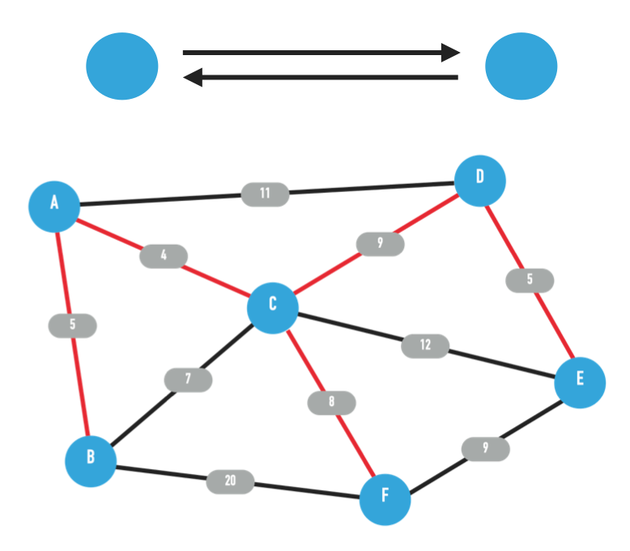
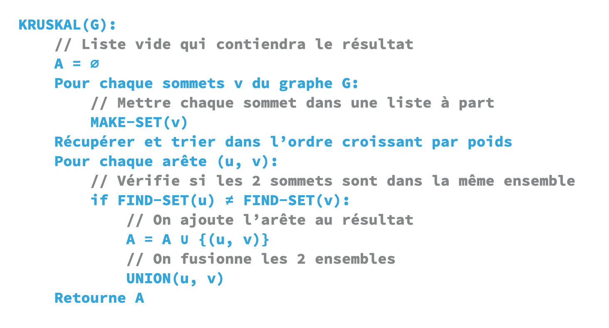
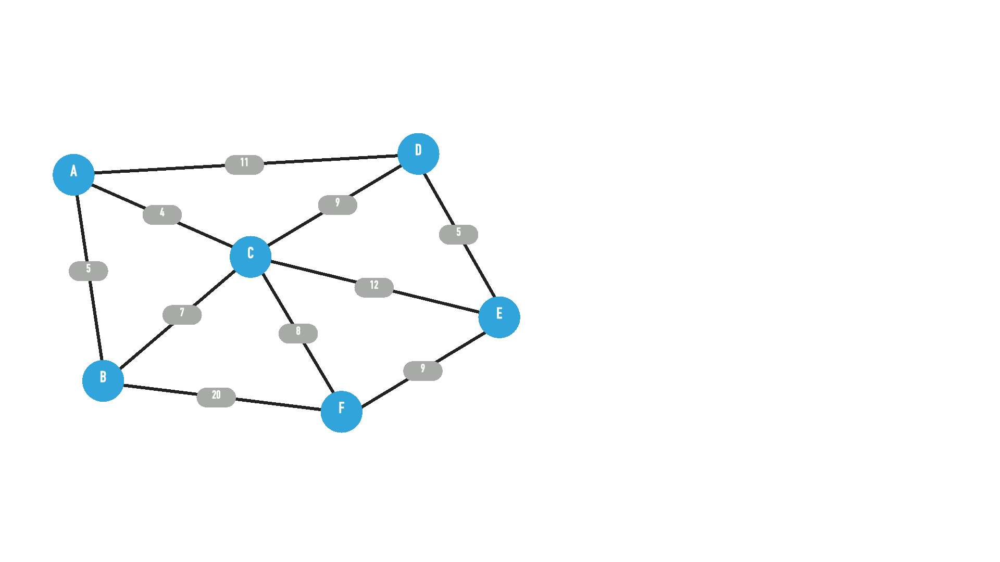
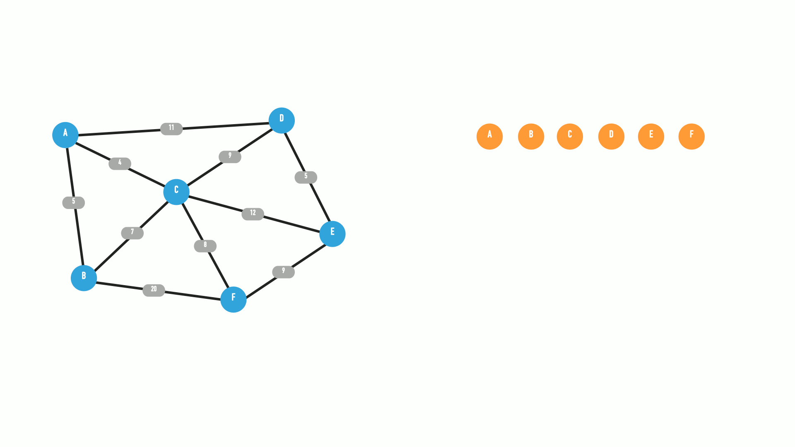
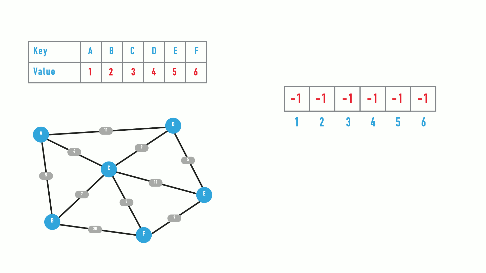
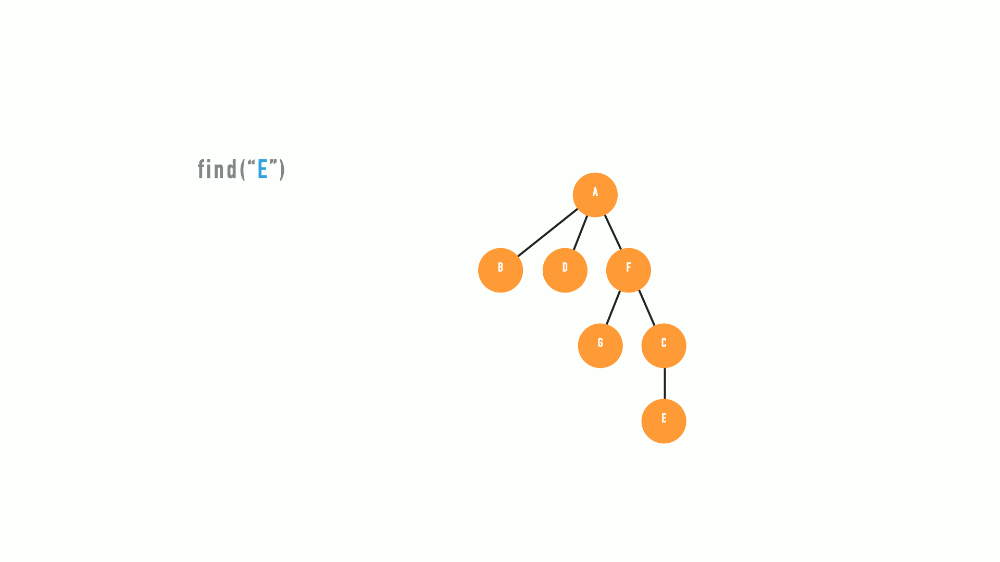
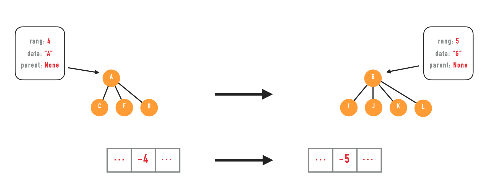
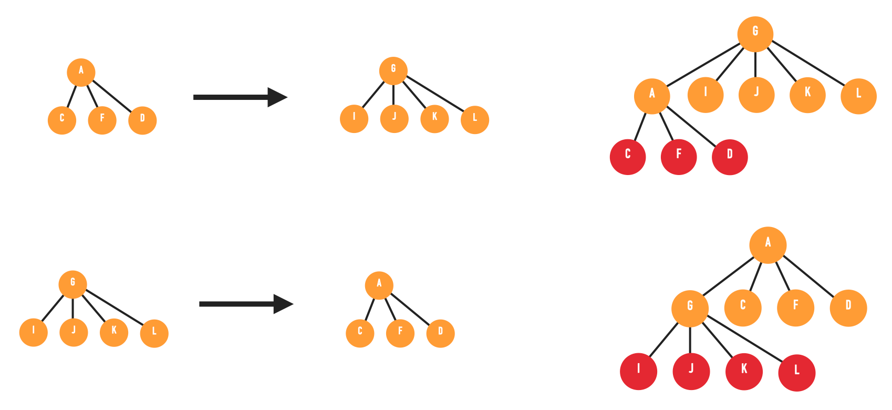

##  Contribution
You can contribute to the improvement of the documentation, by adding, modifying or deleting items.

## Definition
[Kruskal's algorithm](https://en.wikipedia.org/wiki/Kruskal%27s_algorithm) is a search algorithm of [minimum spanning tree](https://en.wikipedia.org/wiki/Minimum_spanning_tree).

This algorithm is part of the [graph theory](https://en.wikipedia.org/wiki/Graph_theory).

The kruskal algorithm is applied to the graph connected, non-oriented and weighted graph.

<ul>
    <li>A connected graph is a graph where no vertex is isolated.</li>
    <li>A non-oriented graph is a graph where the edges have no direction restriction, they can be represented with 2 arrows.</li>
    <li>A weighted graph is a graph where the edges have a value. (can represent a distance)</li>
</ul>

A [tree](https://en.wikipedia.org/wiki/Tree_(graph_theory)) is a graph without cycles.  
One of the main features of Kruskal's algorithm is to find the cycles between nodes already processed.


<p align="left">
    
</p>

## Pseudo-Code

<p align="left">
    
</p>

## Utilisation

This example will be done with the graph below: (an example visualization of the graph, is in the `Definition` section)

```
A <=[5]=> B
A <=[4]=> C
A <=[11]=> D
B <=[7]=> C
B <=[20]=> F
C <=[9]=> D
C <=[12]=> E
C <=[8]=> F
D <=[5]=> E
E <=[9]=> F
```


The variable `Result` will be the result with the minimum coverage tree.

```
Result = []
```


1. First, we put all the nodes into `sets', the `sets' can be lists, nodes in a graph or an array. (`MAKE-SET`)

   

   In this first example, we will take lists.

   ```
   [A] [B] [C] [D] [E] [F]
   ```


2. Then we have to collect the edges and sort them by weight.

   

   When several edges are equal, they are chosen arbitrarily.

   ```
   A <=[4]=> C
   A <=[5]=> B  or  D <=[5]=> E
   D <=[5]=> E  or  A <=[5]=> B
   B <=[7]=> C
   C <=[8]=> F
   C <=[9]=> D  or  E <=[9]=> F
   E <=[9]=> F  or  C <=[9]=> D
   A <=[11]=> D
   C <=[12]=> E
   B <=[20]=> F
   ```


3. We loop for each sorted edge.

   1. The first thing to do in the loop is to check in which list are the edges. (`FIND-SET`)

      ```
      A <=[4]=> C
      
      Current state:
      [A] [B] [C] [D] [E] [F]
      
      [A] and [C] are in different sets.
      ```


      If the 2 sets are different, it means that there is no cycle, so they be will merge. (`UNION`)

         ```
         Before state:
         [A] [B] [C] [D] [E] [F]
         
         After state:
         [A, C] [B] [D] [E] [F]
         ```

         

      2. After merging the sets, the edge is stored in the `Result' variable:

         ```
         Result = [
           ...
           A <=[4]=> C
         ]
         ```

   

   1. Bis. 

      ```
      A <=[11]=> D
      
      Current state:
      [A, C, B, D] [E] [F]
      
      [A, C, B, D] are in the same set, so we don't merge to avoid a cycle.
      ```

      

4. Finally, we return the variable `Result` which contains all the edges of the tree covering minimum

   ```
   return Result
   ```

<p align="left">
    
</p>

### Example with tree

We have seen roughly how `Kruskal' works.

The example was with a list, let's see another example with a tree.


The operation is the same, for the `FIND-SET` we return the parent of the graph.

```
  |A|
|B| |C|  => A
    |D|
    
  |E|    => E
```

In the first case the parent of `D` is `A`.  
In the second case the parent of `E` is `E`.

In `parent`, we return the parent of the graph


Operation for the `UNION` .

```
   |A|            |A|                |E|
|B|   |C|  =>  |B|   |C| |E|  or  |G|   |A|
      |D|            |D| |G|          |B| |C|
                                          |D|
  |E|      =>
  |G|
```

We merge graphs randomly, an improvement is to merge from the smallest to the largest tree (cf: [Optimizations](#optimization)).

<p align="left">
    
</p>

### Example with table

The operation with the table is one of the least resource greedy.

The initialization of the table is done with `-1`, the size of the array corresponds to the number of nodes in the graph. (`MAKE-SET`)

```
[-1, -1, -1, -1, -1, -1]
```


A simple array is enough, but for my example I added a dictionary to link the names of the nodes and the indexes of the array.

```
{
  A: 0
  B: 1
  C: 2
  D: 3
  E: 4
  F: 5
}

[-1, -1, -1, -1, -1, -1]
 A   B   C   D   E   F 
```


The specificity of the table is that `negative numbers`, not being valid indexes, indicate that there is no parent and `positive numbers` are indexes to the parents.

```
arr = [-3, 0, -1, 1, -1, -1]
       A   B  C   D  E   F
 
If we're looking for "D's" parent.
arr[index(D)] = 1

1 is positive, so it's an index.
arr[1] = 0

0 is positive, so it's an index.
arr[0] = -3

-3 is negative, so there's no parent.

He himself is the parent, so we get his index back which is 0.

Parent of "D" is 0.
```


For the `FIND-SET`, we return the index:

``` 
arr = [-3, 0, -1, 1, -1, -1]
        A  B   C  D   E   F
       
Parent of "D" is 0.
The parent of "B" is 0 => NON-UNION

Parent of "A" is 0.
The parent of "E" is 4 => UNION
```

For the `UNION`, this method already implements an improvement which is the `rang`.

The `rang` allows you to merge the `sets' from the smallest to the largest. (See below)

```
arr = [-3, 0, -1, 1, -1, -1]
        A  B   C  D   E   F
        
arr[index(D)] = arr[index(B)] = arr[index(A)] = -3
arr[index(E)] = -1

Parent of "D" is 0.
The parent of "E" is 4 => UNION
```

We merge `E` into `A`, because the rank of `set A` (-3) is greater than the rank of `set E` (-1)

For each merger, the ranks are added together.

```
A = -3 becomes A = -4
E = -1 becomes E = 0 (index of A)

arr = [-4, 0, -1, 1, 0, -1]
        A  B   C  D  E   F
        
If E = -2, so:
A = -3 becomes A = -5
E = -2 becomes E = 0 (index of A)
```

<p align="left">
    
</p>


## Optimization

 #### Path compression

Path compression is done at `FIND-SET' is not at `UNION', and is not done all at once.


Here is an example with the same 2 `FIND-SET`:

```
arr = [-3, 0, -1, 1, -1, -1]
        A  B   C  D   E   F
        
find(D) = 0
arr[index(D)] => arr[index(B)] => arr[index(A)]
```

The algorithm is traced back to the root of the `set' which is the `0' index.

We check if the parent of D is `positive`. (If it is negative, it has no parent, it is itself the parent).
And we check if the parent of D (`1`) is different from the root index of the `set` (`0`).

It is the case, so we apply path compression.

Then `arr [index(D)] = 0`.

If we do another search

```
arr = [-3, 0, -1, 0, -1, -1]
        A  B   C  D   E   F

find(D) = 0
arr[index(D)] = arr[index(A)]
```

One less hit.

<p align="left"> 
    
</p>


<p align="left">
    
</p>


#### The rank

As we have seen above, 'rank' is used to optimize mergers.

By merging from the smallest `set' to the largest, less work is given to `path compression' and more paths are `1 hit' from the parent of the `set'.

The array method implements this by default.

In the algorithm, a simple

```
A.rang > G.rang:
  G.parent = A
sinon
  A.parent = G
```

<p align="left">
    
</p>


This example shows the optimized method and the non-optimized method.

<p align="left">
    
</p>
